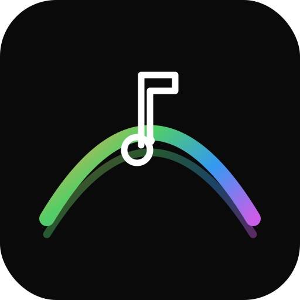
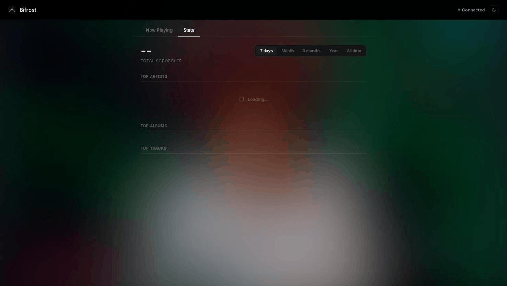

<p align="center">
  
</p>

<h1 align="center">Bifrost</h1>

<p align="center">
  <strong>Bridge your Sonos speakers to Last.fm</strong>
</p>

<p align="center">
  <a href="https://github.com/marcocampos/bifrost/actions/workflows/ci.yml"></a>
  <a href="https://www.python.org/downloads/"></a>
  <a href="https://github.com/marcocampos/bifrost/blob/main/LICENSE"></a>
</p>

<p align="center">
  
</p>

---

Bifrost automatically scrobbles songs playing on your Sonos system to Last.fm, with a real-time web UI for monitoring playback, browsing your listening history, and exploring stats.

## Features

- **Automatic scrobbling** from all Sonos speakers on your network
- **Real-time web UI** with album art, now playing, and WebSocket updates
- **Listening stats** with top artists, albums, and tracks by time period
- **Recent scrobbles** fetched live from your Last.fm profile
- **Love tracks** directly from the web UI with a single click
- **Last.fm links** on all track, artist, and album names
- **Speaker filtering** to scrobble from specific speakers only
- **Grouped speaker handling** so grouped rooms only scrobble once
- **Light and dark theme** with system preference detection
- **PWA support** for mobile home screen installation
- **Structured JSON logging** for easy monitoring and debugging
- **Health check endpoint** at `/api/health` for uptime monitoring

## Quick Start

### Prerequisites

- Python 3.14+
- [uv](https://docs.astral.sh/uv/) package manager
- Sonos speakers on the same local network
- [Last.fm API account](https://www.last.fm/api/account/create)

### Install and Run

```bash
git clone https://github.com/marcocampos/bifrost.git
cd bifrost

uv sync

# Interactive Last.fm authentication
uv run bifrost auth

# Copy credentials to .env
cp .env.example .env
# Paste the output from bifrost auth into .env

# Start Bifrost
uv run bifrost
```

Open **http://localhost:8080** in your browser.

### Docker

```bash
docker compose up -d
```

Or build and run manually:

```bash
docker build -t bifrost .
docker run --network=host --env-file .env bifrost
```

> `--network=host` is required for Sonos UPnP/SSDP multicast discovery to work.

## Configuration

All configuration is via environment variables (`.env` file supported):

| Variable | Required | Default | Description |
|----------|:--------:|---------|-------------|
| `LASTFM_API_KEY` | Yes | | Last.fm API key |
| `LASTFM_API_SECRET` | Yes | | Last.fm API secret |
| `LASTFM_SESSION_KEY` | * | | Last.fm session key |
| `LASTFM_USERNAME` | * | | Last.fm username |
| `LASTFM_PASSWORD_HASH` | * | | MD5 hash of Last.fm password |
| `SONOS_SPEAKERS` | No | *(all)* | Comma-separated speaker names to filter |
| `WEB_PORT` | No | `8080` | Web UI port |
| `LOG_LEVEL` | No | `INFO` | Logging level |

\* Provide either `LASTFM_SESSION_KEY` **or** both `LASTFM_USERNAME` + `LASTFM_PASSWORD_HASH`. Run `bifrost auth` for interactive setup.

## Homelab Deployment

Bifrost is designed to run as a long-lived service on your local network.

### Docker Compose (recommended)

```yaml
services:
  bifrost:
    build: .
    network_mode: host
    env_file: .env
    restart: unless-stopped
```

### systemd Service

```ini
[Unit]
Description=Bifrost - Sonos to Last.fm scrobbler
After=network.target

[Service]
Type=simple
WorkingDirectory=/opt/bifrost
EnvironmentFile=/opt/bifrost/.env
ExecStart=/opt/bifrost/.venv/bin/bifrost
Restart=always
RestartSec=10

[Install]
WantedBy=multi-user.target
```

```bash
sudo cp bifrost.service /etc/systemd/system/
sudo systemctl enable --now bifrost
```

### Raspberry Pi / NAS

Works out of the box with Docker. Just ensure the device is on the same network as your Sonos speakers.

## API Reference

| Endpoint | Method | Description |
|----------|--------|-------------|
| `/` | GET | Web UI |
| `/ws` | WebSocket | Real-time playback updates |
| `/api/health` | GET | Health check (Last.fm connectivity + speaker count) |
| `/api/status` | GET | Current playback state |
| `/api/history?limit=5` | GET | Recent scrobbles from Last.fm |
| `/api/stats?period=7day` | GET | Listening stats (periods: `7day`, `1month`, `3month`, `12month`, `overall`) |
| `/api/love?artist=X&title=Y` | POST | Love a track on Last.fm |
| `/api/unlove?artist=X&title=Y` | POST | Unlove a track |
| `/api/loved?artist=X&title=Y` | GET | Check if a track is loved |

## Development

```bash
# Install dependencies
uv sync

# Run tests
uv run pytest -v

# Run with coverage
uv run pytest --cov=bifrost --cov-report=term-missing

# Lint and format
uv run ruff check src/ tests/
uv run ruff format src/ tests/

# Install pre-commit hooks
uv run pre-commit install
```

## Contributing

Contributions are welcome! However, please note:

1. Fork the repository
2. Create a feature branch from `main`
3. Write code with tests
4. Ensure `ruff check` and `ruff format --check` pass
5. Open a pull request

Direct pushes to `main` are not allowed. All changes require a pull request with passing CI (lint + test).

> **Note:** We are under no obligation to accept any pull request. PRs may be declined for any reason, including but not limited to scope, quality, or project direction.

## Trademarks

**Sonos** is a registered trademark of Sonos, Inc. **Last.fm** is a registered trademark of Last.fm Ltd. This project is not affiliated with, endorsed by, or sponsored by Sonos, Inc. or Last.fm Ltd.

## License

This project is licensed under the [MIT License](LICENSE).

## Disclaimer

THE SOFTWARE IS PROVIDED "AS IS", WITHOUT WARRANTY OF ANY KIND, EXPRESS OR IMPLIED, INCLUDING BUT NOT LIMITED TO THE WARRANTIES OF MERCHANTABILITY, FITNESS FOR A PARTICULAR PURPOSE AND NONINFRINGEMENT. IN NO EVENT SHALL THE AUTHORS OR COPYRIGHT HOLDERS BE LIABLE FOR ANY CLAIM, DAMAGES OR OTHER LIABILITY, WHETHER IN AN ACTION OF CONTRACT, TORT OR OTHERWISE, ARISING FROM, OUT OF OR IN CONNECTION WITH THE SOFTWARE OR THE USE OR OTHER DEALINGS IN THE SOFTWARE.
